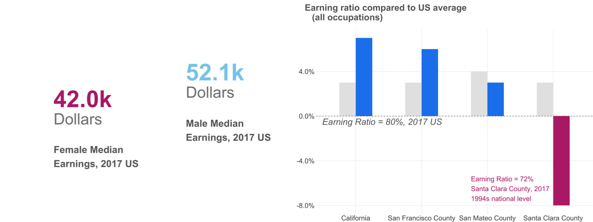

# About Me 
[View My LinkedIn Profile](https://www.linkedin.com/in/peng-liu-188053130/)

📧email: pliu25@usfca.edu

Hi this is Peng!

I'm a master's student in Data Science with working experience in mechanical engineering and materials science. Before joining in [MSDS program](https://www.usfca.edu/arts-sciences/graduate-programs/data-science), I received my Ph.D in mechanical engineering and worked as an associate scientist at National University of Singapore. I have a passion for combining data insights with domain knowledge in real-world applications. 

My fascination with data analytics began while working on my last Ph.D. project. In that project, I built an end to end pipeline that automates data generating, data collection and data analysis for heat transfer measurements and published two journal articles. From then on, I studied as a MS student in Data Science at University of San Francisco, where I developed various skills including machine learning, distributed computing, relational databases, data structures and algorithms,  time series analysis and A/B testing, and I’m also proficient in Python and SQL.

I’ve worked as a data scientist in two internship projects. One of the projects that I am most proud of is working on a team to improve the prediction of airline revenue for a startup company [FLYR](https://www.flyrlabs.com/). My focus is on the development of a multi-step machine learning model that integrates time-series clustering and Vector Autoregression algorithm into the prediction process. This new approach improves the prediction by 16%. I enjoyed working with a team that had diverse skills, from domain experts to data engineers. 

# Data Science Projects
## Machine Learning Algorithms from scratch in Python

Implemented core machine learning algorithms from scratch with comparable performance compared to scikit-learn packages, including Ridge and Lasso Regression, Naive Bayes, Decision Tree, Random Forest and clusterings.

- [Linear regression with regularization](https://github.com/jenniferliumao/Linear-Regression-with-Regularization-from-Scratch-in-Python)
- [Naive Bayes](https://github.com/jenniferliumao/naive_bayes_from_scratch)

## EDA: Gender Pay Gap In San Francisco Bay Area: 

### Is gender gap gradually eliminated in tech industry?
Although the gender pay gap in San Francisco Bay Area is slightly better than the United States as a whole, Santa Clara County, as the center of tech companies, has the largest gender pay gap in the Bay Area and women make up only very small percentage among the workers in tech industry; tech companies in San Francisco Bay Area still need to go a long way towards overcoming the gender inequality.

In this EDA project, we explored the datasets from American community survey, contianing the yearly median earning for female and male in the past 60 years and the employed population and earining by gender and occupation in various regions including US, CA and three main counties in SF Bay area. Then we appplied ggplot to explain what we found and drew some interesting conclusions.

[View the repo of this project](https://github.com/jenniferliumao/gendergap_BayArea_EDA)

